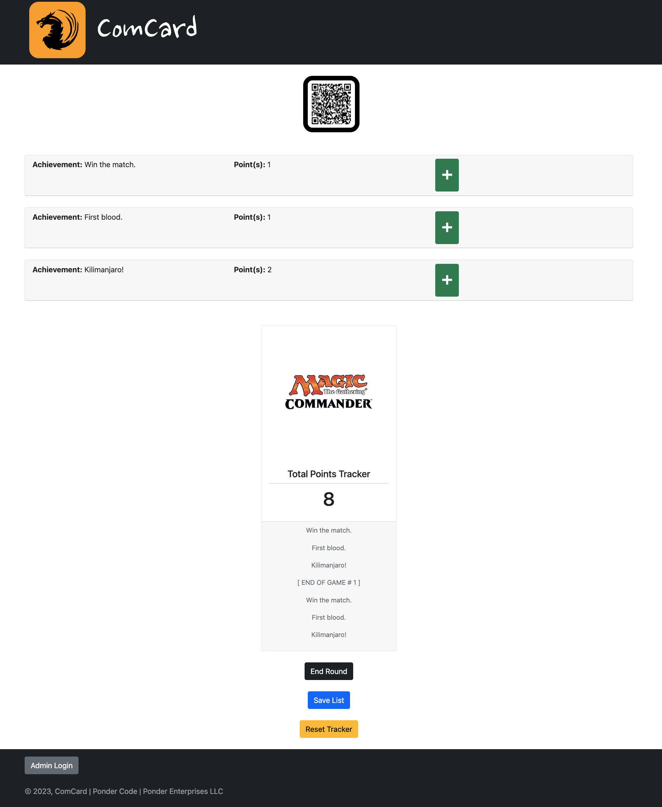

# ComCard: Commander League Point Tracker

## Description:
(Full-Stack, Django, PostgreSQL, React.js) | Magic the Gathering (MTG) Commander league match achievements list and points tracker.

## Deployment Link:
https://commander-league-point-tracker.herokuapp.com/

## Screenshots:
<!--  -->

<!--  -->

## Technologies Used:
#### Front-End:
- HTML
- CSS
- React.js
- Bootstrap
#### Back-End:
- Django
- Django REST Framework
- PostgreSQL
#### Packages:
- webpack
#### Version Control:
- Git
- GitHub
#### Editor:
- VS Code Editor

# References:
#### Development Environment:
// https://docs.djangoproject.com/en/3.2/intro/install/
// https://www.python.org/downloads/
// https://www.postgresql.org/download/
// https://formulae.brew.sh/formula/postgresql
// https://www.npmjs.com/package/file-loader
// https://webpack.js.org/concepts/#loaders
// https://www.npmjs.com/package/react-dom
// https://react-bootstrap.github.io/getting-started/introduction/
#### Deployment:
// https://devcenter.heroku.com/articles/procfile
// https://devcenter.heroku.com/articles/python-gunicorn
// https://www.youtube.com/watch?v=SBBzVbZBOvc
// https://pypi.org/project/whitenoise/#description
// https://pypi.org/project/django-heroku
// https://devcenter.heroku.com/articles/django-app-configuration
// https://medium.com/@qazi/how-to-deploy-a-django-app-to-heroku-in-2018-the-easy-way-48a528d97f9c
#### Deployment Troubleshooting:
// 
#### Information References:
// https://stackoverflow.com/questions/31684375/automatically-create-requirements-txt
// https://medium.com/@kv.kaivalya/getting-started-with-postgresql-on-mac-osx-and-django-a55b1701dffa
// https://stackoverflow.com/questions/55699874/after-installing-psycopg2-i-cannot-import-it-properly
// https://stackoverflow.com/questions/63124161/attempted-import-error-switch-is-not-exported-from-react-router-dom
// https://stackoverflow.com/questions/35171288/error-cannot-resolve-module-style-loader
// https://stackoverflow.com/questions/26069238/call-multiple-functions-onclick-reactjs
// https://stackoverflow.com/questions/23728626/localstorage-and-json-stringify-json-parse
// https://www.freecodecamp.org/news/how-to-use-localstorage-with-react-hooks-to-set-and-get-items/
// https://stackoverflow.com/questions/41052598/reactjs-array-push-function-not-working-in-setstate
// https://stackoverflow.com/questions/39316376/how-to-use-the-increment-operator-in-react
// https://stackoverflow.com/questions/22081556/heroku-django-app-createsuperuser
// https://www.w3schools.com/css/css_positioning.asp
// https://stackoverflow.com/questions/7867427/settimeout-runs-only-once
// https://stackoverflow.com/questions/49085450/settimeout-and-cleartimeout-in-reactjs
// https://stackoverflow.com/questions/55849635/how-to-change-the-primary-color-of-the-react-built-in-bootstrap
#### Images References / Credits:
#### Sounds References / Credits:
#### Fonts / Credits:
// https://fonts.google.com/specimen/Nanum+Brush+Script?query=brush
